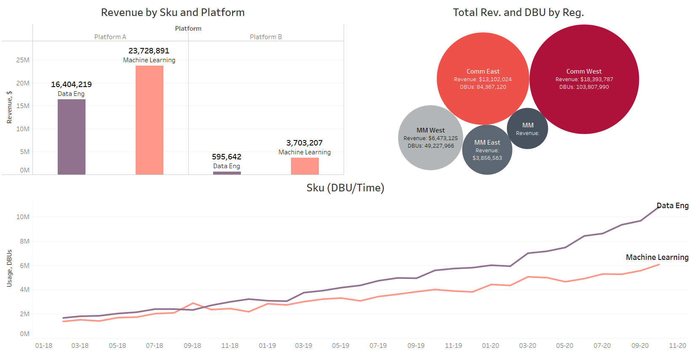
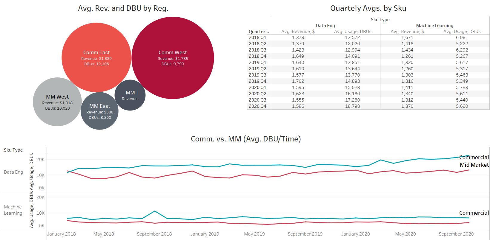
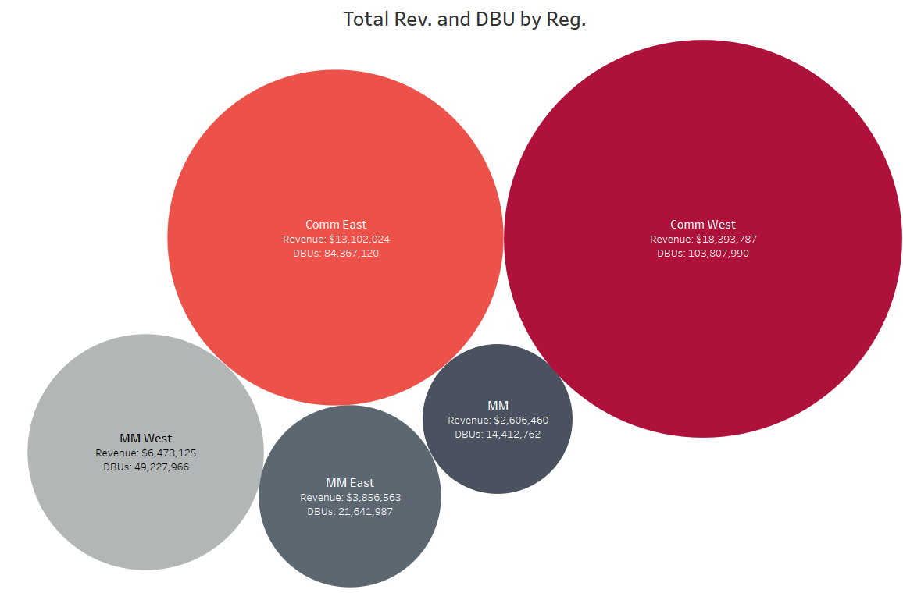
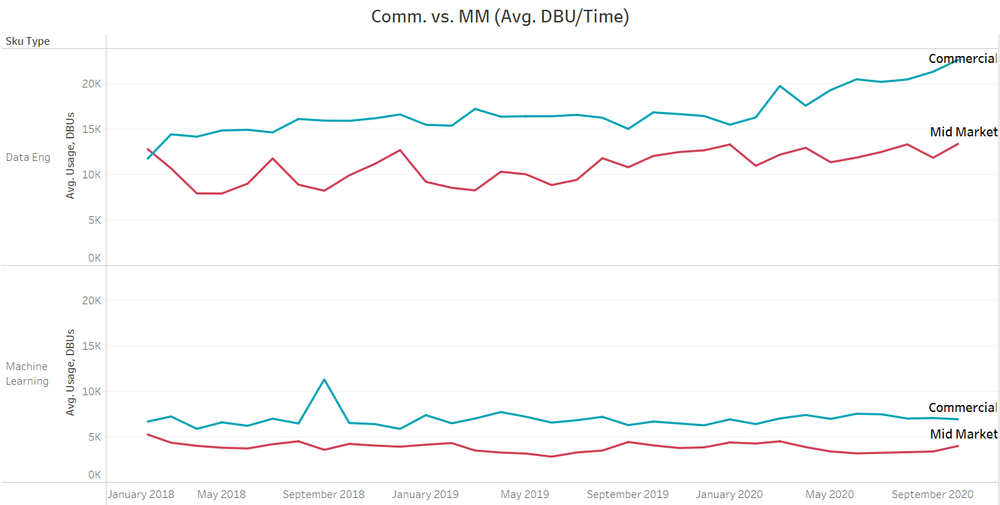

# DBUs and Revenue Analysis

Interactive Visualizations: <a href=https://public.tableau.com/app/profile/laplacef/viz/DBUInsights/DBUInsights>DBU Insights</a>

 

## Summary

Based on the data and analysis, from 2018 to 2020, the company has shown significant growth, with steady increase in both its revenue and the usage of its products and services (DBUs). The main source of DBUs has been from Data Engineering services within the Commercial segment but main source of revenue is ML. Overall revenue and usage for all platforms and Sku types show steady increments month to month. Quartely usage averages as well as month-to-month revenue have positive increase for Data Engineering products, while ML has seen same DBUs over time with flat growth.

## Recommentations

Focus on ML growth to maximize usage and increase revenue, big opportunities for more growth within ML products. Work on increasing monthly DBU average for this market will have high impact on current revenue while exploiting its full potential even more.

### Assumptions About Dataset

- Data provided is accurate and up to date
- Direct correlation exists between usage and revenue
- If analyzed for normality, data will follow normal distribution
- Quality of the data is assured and if any errors exist they are minimal
- Sample provided is representative of company overall data
- Outliers will be present and will add bias to the analysis if overlooked
- Data and observations will be related to one another, example: SkuTypes and Regions

### Insights Gained

- Company has healthy growth over time, steadily increasing both its revenues and usage of its products.
- ML products provide higher revenue, however, Data Eng. products have higher usage by company clients.
- There exists potential for diversification and further growth within products, services, and segments.



## Further Analysis

Based on the insights gathered, specific data for ML services and products would be beneficial to analyze current potential for this market. Currently, ML provides the most revenue but Data Eng. has higher DBUs. If the average ML DBUs can be steadily increased, its revenue could definitely increase thus maximizing its the potential for these types of products.



## Query

```sql
SELECT acc.[Region]
 , SUM(acc.[MRR]) AS Account_MRR
FROM [Accounts] AS acc
LEFT JOIN [Subscriptions] AS subs ON acc.[ID] = subs.[ID]
LEFT JOIN [Success] AS succ ON acc.[ID] = succ.[ID]
WHERE subs.[ContractLength] >= 6 AND subs.[Status] = 'Active'
GROUP BY acc.[Region]
HAVING COUNT(succ.[ID]) >= 1
ORDER BY acc.[Region]
```
